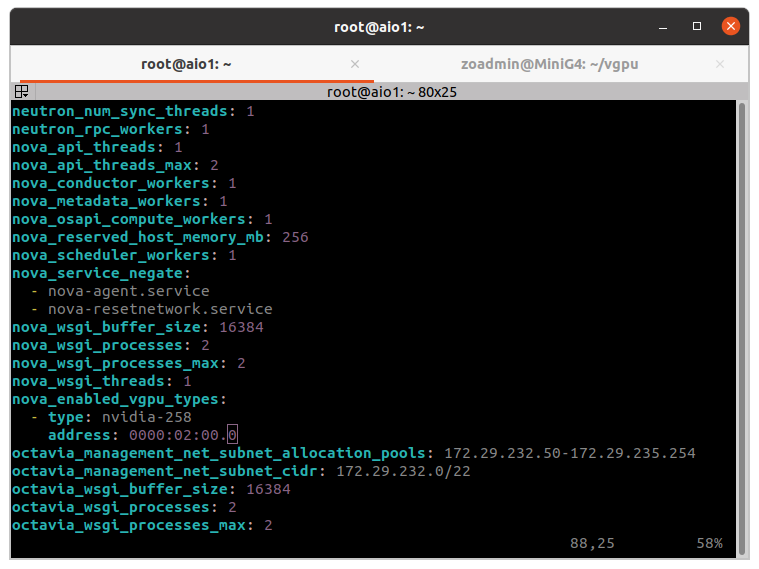
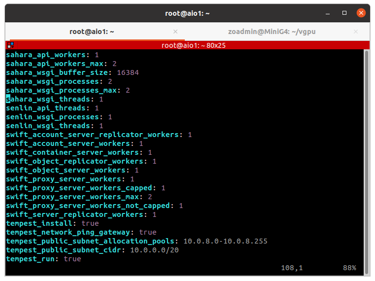
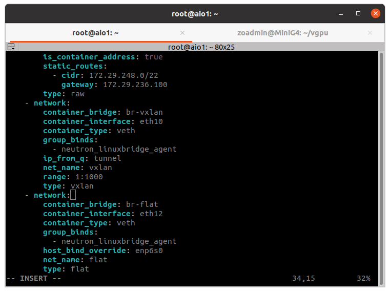
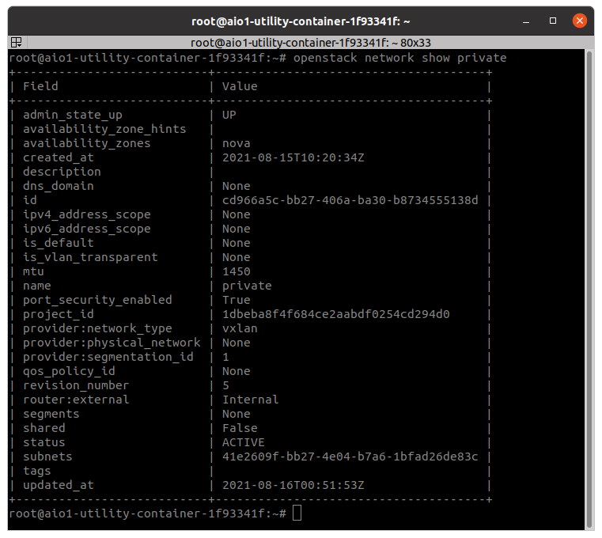
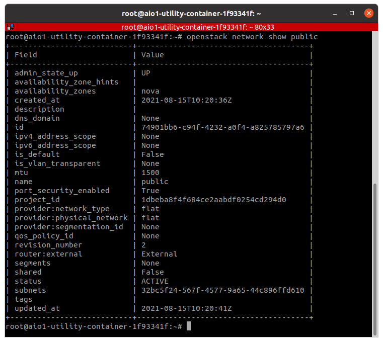
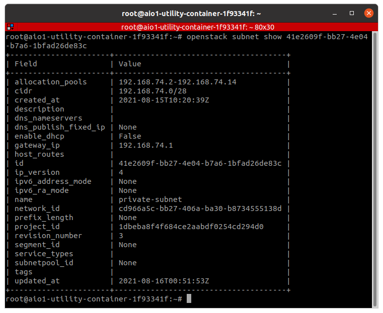
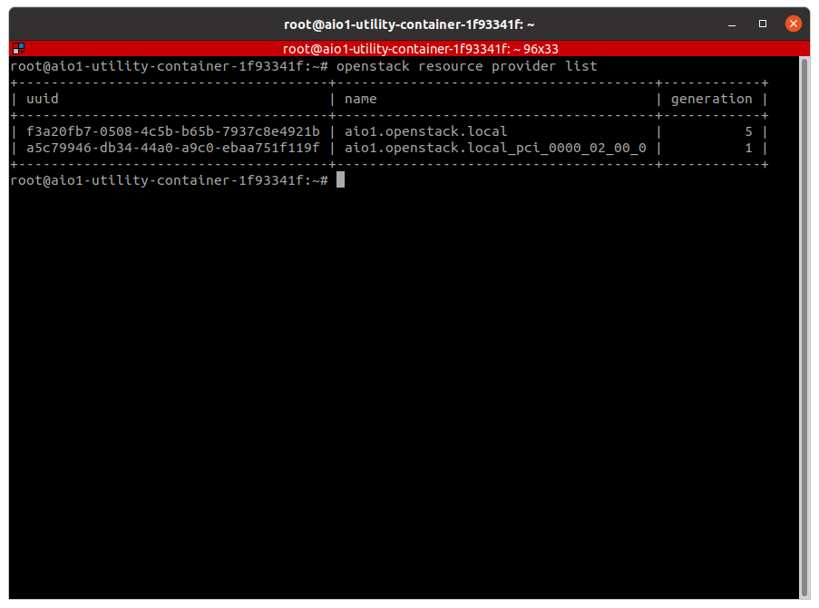
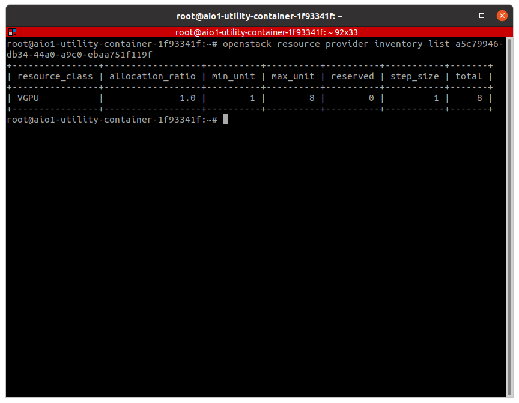

# VGPU-OpenStack
The purpose of this project is to provide instructions on how to enable vgpu_unlock (https://github.com/DualCoder/vgpu_unlock) in an OpenStack environment, using OpenStack-Ansible All-in-One (AIO) to deploy the environment.

## Why VGPU-OpenStack?
That's a good question. There are a lot of fantastic virtualization management systems (Proxmox, Unraid, etc.). All I'm trying to provide is another option. Personally I think OpenStack is great if you want to provide a front end system to remote users that they can manage the virtualized resources themselves, only requiring you to manage the underlying backend. Think of it like providing your own AWS. Combined with a project like vGPU I think it's a fantastic way to setup and provide some virtualized gaming instances with your resources and can even be a great "LAN Party in a Box" system.

#### Requiremendations
* **CPU**: 1+ CPU(s) with as many cores as you can get and support for virtualization.
* **RAM**: I'd recommend AT LEAST 16GB but 64GB sounds a lot better if you are gonna run more than one instance.
* **GPU**: An NVidia Maxwell, Pascal or Turing GPU supported by vgpu_unlock. Limited support is available as well for Volta and Ampere models, but check the vgpu_unlock project as new models are added all the time. For my example, I will be using an RTX 2080Ti. More VRAM allows the use of more and/or larger VMs. More than one graphics card can be used however only a single GRID profile can be used per card. There is also some indication, but I haven't confirmed myself either way, that mixing families (i.e. using a Maxwell and Turing card) is not supported. Additionally, if you have the capability, do not use the NVidia card as your "primary" video card. If you have an Intel or AMD CPU with integrated graphics or a shitty old video card lying around (yeah, I know some of you still have a Radeon HD 5450 lying around, don't lie) use that as your primary as a small amount of video memory is required for your primary to display to function, meaning it can't be allocated for a VM.
* **Disk**: At least 500GB but the more space the better as game libraries add up fast. Also recommend using an SSD.
* **Network**: At least one 1Gbps network port. This project will work on a single, flat network, however having VLAN support will allow you to have separate the front-end access to the VMs and use non-tunneled networks. Having a second network port allows for having a physical separation as well. For this scenario I have a flat network using the address space 10.0.0.0/20. I am going to use the range 10.0.8.0-10.0.8.255 for the external network the VMs will be accessed from. On the host, this network is attached to physical network adapter enp6s0. You will need the logical name of the network adapter attached to your external network. You can find a list of all adpaters and their associated IPs by running the command ```ip a sh```
* **OS**: For these instructions I am using Ubuntu 20.04 (18.04 is not supported). You CAN use a Red Hat-based distro, such as RHEL 8, however you will need to adjust the commands in this guide to your distro.

Additionally you will need to get an evaluation license for your GRID guests. I will provide a link below. You will need the license to be able to get the GRID driver for KVM, which is required by the host, as well as the software to run the licensing server for the guest instances to use. Running guest instances unlicensed will result that the performance inside the VM capped after a certain amount of time, resulting an a framerate that is around "a TI-89 playing Crysis."

Additionally you will need another machine with a hypervisor installed to create a Windows image to use in the OpenStack environment. I used Ubuntu 20.04 Desktop Edition with QEMU/KVM and Virtual Machine Manager for the image creation steps, however you can use other options such as Hyper-V, VirtualBox, ESXi, etc. While you CAN install the OS from an ISO in OpenStack, I would not recommend this route and will not provide steps for this.

#### Helpful terminology

## Instructions
### Part 1 -  This summer, prepare your host for VGPU-OpenStack
First thing you will need to do is pop in to your "root" user. This will just simplify the process. If you want to do it from a "sudo" user feel free to but these are my instructions and I'm not changing them just for you. Once in the root user we will make sure the system is updated and install some required packages. DKMS is required for building the kernel modules for NVidia vgpu and python3-pip is required to install pip3, which is required to install the python library for Frida, which is used by vgpu_unlock. The unzip package is for extracting the NVIDIA drivers.
```
sudo -i
apt update && apt upgrade -y
apt install dkms python3-pip unzip -y
pip3 install frida
```
After you have completed this step, we will need to modify the /etc/hosts file to ensure that the entry for "127.0.1.1" is disabled. Failure to do so will result in the RabbitMQ server failing to configure and start. Using the editor of your choice (I don't judge here, use vi(m), nano, pico, hex editor, export to a Windows machine and edit in Wordpad, whatever), add a comment to the beginning of the line for the entry for address "127.0.1.1" and save the change. Confirm the change matches below:
```
root@vgpu:~# grep 127.0.1.1 /etc/hosts
#127.0.1.1 vgpu.myquantumcs.com vgpu
```
Next we need to modify the global DNS settings. I'm assuming you are using the Ubuntu default now of Systemd-Resolved. If you are using the older resolvconf method of assigning DNS I will assume you know how to make the necessary modifications so I'm only going to show how to change the Systemd-Resolved settings. This step is necessary as interface-specific DNS settings will not copy over the the method of external connection on the host changes from the default ethernet interface to the bridged interface.

```
sed -i.bak -e 's/#DNS=/DNS=<space_delimeted_list_of_your_dns_servers>/g' /etc/systemd/resolved.conf 
systemctl restart systemd-resolved
```


Finally, we will blacklist the nouveau graphics driver kernel module, as this will interfere with the NVidia driver. Then we will update the initramfs image and reboot for the module change to take effect:

```
echo -e "blacklist nouveau\noptions nouveau modeset=0" >> /etc/modprobe.d/nouveau.conf
update-initramfs -u
reboot now
```

After reboot you should be able to confirm that the nouveau driver is no longer loaded:

```
root@vgpu:~# lsmod | grep nouveau
root@vgpu:~#
```

### Part 2 - Installing drivers or How I Learned to Stop Worrying and Love the DKMS
For this part you will need the NVIDIA GRID Linux Drivers for KVM mentioned in the Requiremendations section earlier.
Assuming you have them in ZIP format, we need to extract them first and we'll put them in a subdirectory called "GRID". Assuming you have already done so, you can skip this step and run subsequent commands from where your extracted files are located:
```
unzip NVIDIA-GRID-Linux-KVM-460.32.04-460.32.03-461.33.zip -d ./GRID && cd ./GRID
chmod +x NVIDIA-Linux-x86_64-460.32.04-vgpu-kvm.run
```
Now we are ready to install the GRID host driver:
``` 
./NVIDIA-Linux-x86_64-460.32.04-vgpu-kvm.run --dkms
```


### Part 3 - Install vGPU_unlock - Dial M for MDEV
Now that the NVIDIA GRID driver is installed we can proceed to install vgpu_unlock. In short, this project intercepts the device ID calls and changes them to match a GRID-capable card that uses the same chip as the GeForce card in your system. There's probably more to it than that but I attribute it to wizardry by people way smarter than me. 

First we will need to download the files for the project. For the sake of this tutorial, I'm putting the files in /opt/vgpu_unlock.
```
git clone https://github.com/DualCoder/vgpu_unlock /opt/vgpu_unlock
```
Now we need to modify the NVIDIA vgpud and vgpu-mgr services to use vgpu_unlock to execute the services. We will do this by modifying the ExecStart line of service unit files:
```
systemctl edit nvidia-vgpud.service --full
```

```
systemctl edit nvidia-vgpu-mgr.service --full
```

Once completed we need to reload the service unit files with the changes.
```
systemctl daemon-reload
```
Now we will need to modify some of the NVidia driver files to use vgpu_unlock:
```
printf '%s\n' '0?#include?a' '#include "/opt/vgpu_unlock/vgpu_unlock_hooks.c"' . x | ex /usr/src/nvidia-460.32.04/nvidia/os-interface.c 
echo "ldflags-y += -T /opt/vgpu_unlock/kern.ld" >> /usr/src/nvidia-460.32.04/nvidia/nvidia.Kbuild 
```
Next, we need to remove the existing NVidia DKMS kernel module:
```
dkms remove -m nvidia -v 460.32.04 --all
```
Below is output from the command:
```
-------- Uninstall Beginning --------
Module:  nvidia
Version: 460.32.04
Kernel:  5.4.0-80-generic (x86_64)
-------------------------------------

Status: Before uninstall, this module version was ACTIVE on this kernel.

nvidia.ko:
 - Uninstallation
   - Deleting from: /lib/modules/5.4.0-80-generic/updates/dkms/
 - Original module
   - No original module was found for this module on this kernel.
   - Use the dkms install command to reinstall any previous module version.


nvidia-vgpu-vfio.ko:
 - Uninstallation
   - Deleting from: /lib/modules/5.4.0-80-generic/updates/dkms/
 - Original module
   - No original module was found for this module on this kernel.
   - Use the dkms install command to reinstall any previous module version.

depmod...

DKMS: uninstall completed.

------------------------------
Deleting module version: 460.32.04
completely from the DKMS tree.
------------------------------
Done.

```
Now we will rebuild the module with with the vgpu_unlock changes:
```
dkms install -m nvidia -v 460.32.04
```
Output from running the command:
```
Creating symlink /var/lib/dkms/nvidia/460.32.04/source ->
                 /usr/src/nvidia-460.32.04

DKMS: add completed.

Kernel preparation unnecessary for this kernel.  Skipping...

Building module:
cleaning build area...
'make' -j32 NV_EXCLUDE_BUILD_MODULES='' KERNEL_UNAME=5.4.0-80-generic IGNORE_CC_MISMATCH='' modules......
cleaning build area...

DKMS: build completed.

nvidia.ko:
Running module version sanity check.
 - Original module
   - No original module exists within this kernel
 - Installation
   - Installing to /lib/modules/5.4.0-80-generic/updates/dkms/

nvidia-vgpu-vfio.ko:
Running module version sanity check.
 - Original module
   - No original module exists within this kernel
 - Installation
   - Installing to /lib/modules/5.4.0-80-generic/updates/dkms/

depmod...

DKMS: install completed.
```

Now we reboot for all the changes to take effect:
```
reboot now
```

Upon reboot, vgpu_unlock should now be working and the NVIDIA services should be functioning properly. To verify the vgpu-mgr is running properly:
```
systemctl status nvidia-vgpu-mgr.service
```
The service should be ```Active: active (running)``` and you should see output similar to ```vgpu bash[1129]: vgpu_unlock loaded.``` on one of the log lines.


To verify the vgpud service, run:
```
systemctl status nvidia-vgpud.service
```

The status should be ```Active: inactive (dead)``` and that's fine. The very bottom line should say ```vgpu systemd[1]: nvidia-vgpud.service: Succeeded.``` This indicates that the service ran as needed properly.


To confirm vgpu_unlock is working you should now have a device on the "Mediated Device" (MDEV) bus. You should be able to see all available usable cards using the following command: 


```
ls -alh /sys/class/mdev_bus/
```

The output should show a folder with a name that matches the PCI Bus ID of your graphics card(s). 


You can confirm this using the command:

```
nvidia-smi
```


### Part 4 - Installing OpenStack-Ansible All-In-One - A(IO) New Hope
Now we will begin the process of installing OpenStack on the host system. First we will need to download openstack-ansible. We will also be using the "stable/wallaby" branch as it's the latest stable release.
```
git clone -b stable/wallaby https://opendev.org/openstack/openstack-ansible /opt/openstack-ansible && cd /opt/openstack-ansible
```

Next we need to run the bootstrap script to prepare the host to execute the Ansible plays:
```
scripts/bootstrap-ansible.sh
```
Once completed you should see ```System is bootstrapped and ready for use.``` echoed. Now we will proceed to execute the bootstrap-aio script to create the configurations for OpenStack
```
scripts/bootstrap-aio.sh
```

At this point we need to make some changes to the OpenStack-Ansible configurations. First we need to determine what kind of GRID profile we will be running on each card on this host. Luckily, I have written a handy one-line script that will provide a list of all the supported profiles that each GPU in your system supports, the corresponding profile name, the amount of VRAM used by the profile and the bus address of the device the profile supports:
```
for a in $(ls /sys/class/mdev_bus/); do echo "TYPE         NAME              VRAM                Bus ID" && for i in $(ls /sys/class/mdev_bus/$a/mdev_supported_types); do echo "$i - $(cat /sys/class/mdev_bus/$a/mdev_supported_types/"$i"/name) - $(awk '{print substr($3,1,length($3)-1)}' /sys/class/mdev_bus/$a/mdev_supported_types/"$i"/description)" - $a ; done; done
```


What we are looking for are profiles with "-XQ" where X is a number corresponding to the amount of VRAM, in gigabytes, the profile supports. "Q" profiles are "Virtual Workstations" profiles which is the kind we will need for this setup. If you wish to look at the capabilities of the other profile types, feel free but that is beyond the scope of this tutorial. I will include a link below to the NVidia GRID guide that provides a complete list of supported profiles and their capabilities. 

The choice of what profile to use is entirely up to you but the limiting factor is going to be the amount of VRAM of the card. In this case, I am using an RTX 2080TI, which has 11GB of VRAM. This would allow me to use 11x1Q, 5x2Q, 3x3Q, 2x4Q, 1x6Q and 1x8Q allocated vGPUs on a single card.  You should be able to run 1080p comfortably on a 2Q profile, however remember that you are splitting the resources of the card, so the more VMs running the more they are sharing not just memory but GPU performance, so you'll want to make sure to gauge the performance of your VMs. You can use more than one type in a host if you have multiple cards, say if you are some crazy guy with 3x1070Tis and provision them with 2Q profiles but you throw in a 2080Ti and provide some 4Q profiles for "high performance" VMs. 

For this tutorial, I am going to allocate 3Q profiles for this card, which is profile type nvidia-258.  

Now we need to modify the Nova (Compute) service configuration to let it know what profiles are being used by each card. To do this, we will edit the OpenStack-Ansible user_variables file. To do so, using your favorite editor, open /etc/openstack_deploy/user_variables.yml. The option we want to configure is "nova_enabled_vgpu_types: {}" (this option is new to Wallaby so if you sourced a different branch of OpenStack-Ansible this option will not work). Add the config options using the following format:
```
nova_enabled_vgpu_types: 
  - type: nvidia-258
    address: "0000:02:00.0"
```




Type being the profile type selected and address being the PCI Bus address of the device.

In this same file, we additionally need to make some adjustments to the "tempest" settings responsible for the creation and configuration of the "public" network, which is the network you will use to access the instances. The values we want to modify are "tempest_public_subnet_allocation_pools" and "tempest_public_subnet_cidr". For "tempest_public_subnet_cidr" this should match the CIDR address of the external, flat network you will be accessing the instances. 



Save and exit the file. Now we will need to make a change to the configuration of the underlying networking to have the bridge to the "flat" network point to the proper physical network adapter of the host, otherwise the networks created on OpenStack will be accessible. Open up /etc/openstack_deploy/openstack_user_settings.yml in your editor of choice. The section we are looking for is in "global_overrides->provider_networks" We are looking for the provider network with the "net_name" and "type" value of "flat". We need to change the "host_bind_override" value to match the logical name of the host interface used to connector to your network. 



Once changed, save and exit the file. Now we are ready to deploy the AIO. Switch to the playbooks directory for openstack-ansible and begin the installation process.

```
cd /opt/openstack-ansible/playbooks/
openstack-ansible setup-hosts.yml
openstack-ansible setup-infrastructure.yml
openstack-ansible setup-openstack.yml
```

Depending on the system and the type of disk you are using this entire process can take anywhere from about 30 minutes to two hours. If you run in to any problems, Google is usually your best friend, however I will include my Discord user below, feel free to PM me, just, ya know, remember I have like a work and a family and all that.

Once completed you should now have a number of LXC containers that have been made. You can confirm this but running the LXC list command ```lxc-ls```. All the containers should have a prefix saying "aio1" which is what the hostname of your machine should now be set to. At the bottom of this tutorial I will include a brief description of what each container does. 

As part of the AIO deployment process, some assets should have already been pre-created for you. To run commands against the OpenStack APIs, you will need to have the OpenStack client installed on the machine you are running commands from. Fortunately, the AIO process includes a "utility" container which has the client pre-installed. Access the utility container by running the following command: 

```
lxc-attach -n $(lxc-ls -1 | grep utility)
```

Before running the commands, you will want to source the "openrc" file that has been created. This includes the configuration for accessing the API endpoints as well as the admin username and password. This file will be located inside the home folder of the root user (/root):

```
source /root/openrc
```

For the steps later that require access to the GUI you will want to cat this file to pull the generated password for the admin account.

Before we begin though we will want to make a small change to the networking inside of OpenStack. Two networks should have been created in the OpenStack environment. You can confirm this now by running the OpenStack client command:

```
openstack network list
```


You should see two networks, "private" and "public". You can get the detail for each network by using the command ```openstack network show <network_name_or_id>```:

```
openstack network show private
openstack network show public
```




For the private network, the one field we need to pull right now is the "subnets" value. The subnet provides a block of addressible IPs to a network and additional configuration data. Without going too deep in to the black magic that is Neutron, networks can have multiple subnets however a subnet can only belong to one network. Usually however you will only see one subnet per network and for this tutorial you will only need the one. Get the current configuration of the subnet by using :

```
openstack subnet show <id_of_subnet_from_network_command>
```



What you'll see is the "enable_dhcp" field is wet to "False". We need to set this to true. To correct this run:
```
openstack subnet set --dhcp <id_of_subnet_from_network_command>
```

There will be no output from this command, run your "openstack subnet show" command you previously executed and you should now see the "enable_dhcp" value set to "true".

Last thing we want to do before the next part is verify that the Placement service see that you have allocatable vgpus. To do this let's get a list of all the resources the Placement service sees:

```
openstack resource provider list
```



You should see one provider with the hostname and another with the same hostname but appended is the PCI bus ID that should match the PCI bus ID of your gpu (which you configured in the OpenStack deployment settings previously). Get the ID value of of the listing with the PCI bus ID and use the value for the command:

```
openstack resource provider inventory list <ID_of_resource_provide_with_PCI_ID>
```



You should have an entry with a "resource_class" of "VGPU".

Congratulations, you now have a working OpenStack environment with allocatable vGPUs.

### Part 5 - Do you wanna build an image?

So I'm sure at this point you might be asking "Can't I just mount an ISO and install Windows from inside OpenStack?" Yes ... you could ... but it's not trivial and it's not how OpenStack is designed to work. For this tutorial, it'll be easiest to create a golden image inside another VM. The easiest method would be to use Qemu+KVM from another Ubuntu machine which is what I'm doing, accessing via Virtual Machine Manager. This method natively creates a qcow2 image which is easiest to work with, however you can just as easily use Hyper-V, VirtualBox or VMWare and I will include a step below on how to convert the image to the qcow2.

So go ahead and fire up your virtualization platform and install Windows 10. It's okay I can wait. However after it's installed and you get to the "Out of Box Experience" (OOBE), do not continue with the configuration of your VM


## Links:
VGPU Unlock - https://github.com/DualCoder/vgpu_unlock
