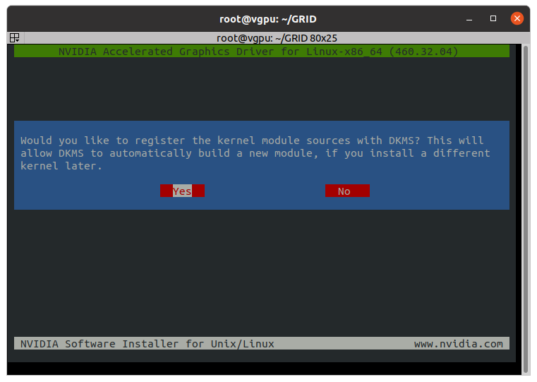
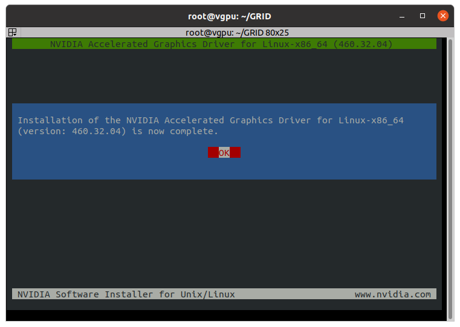
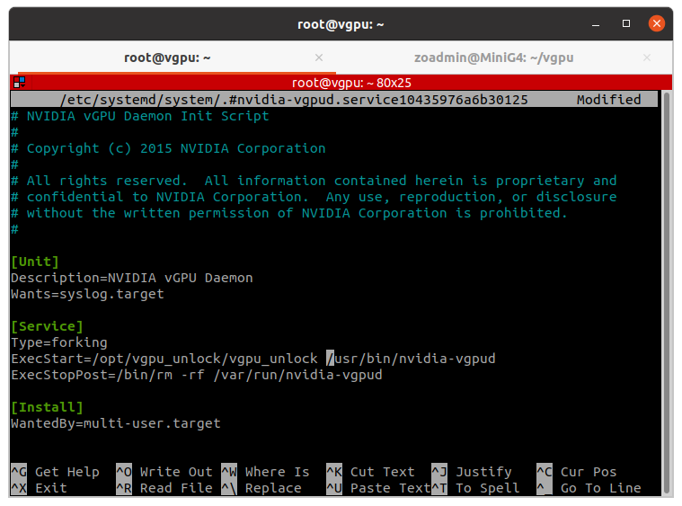
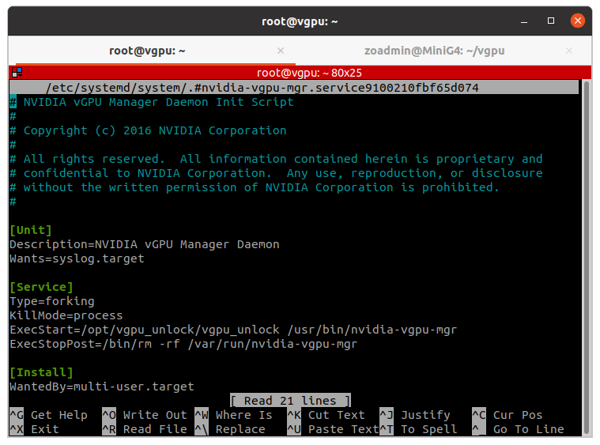
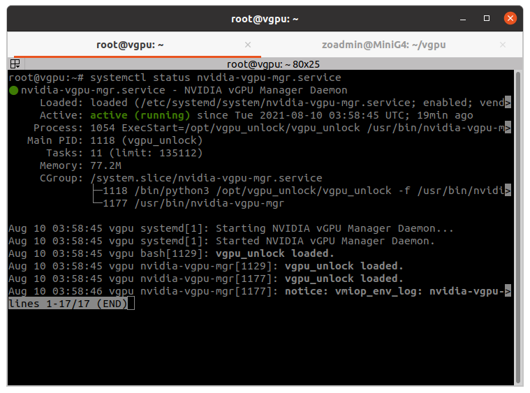
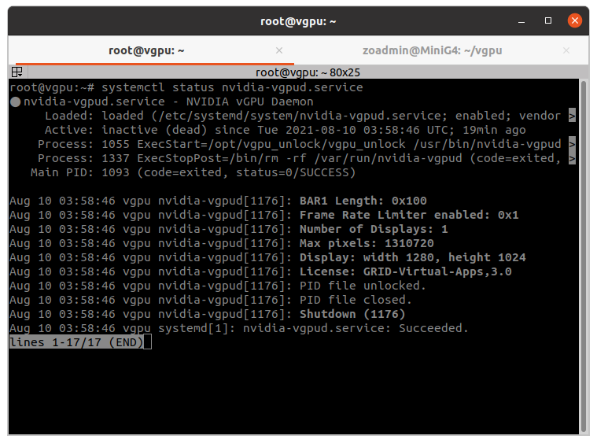
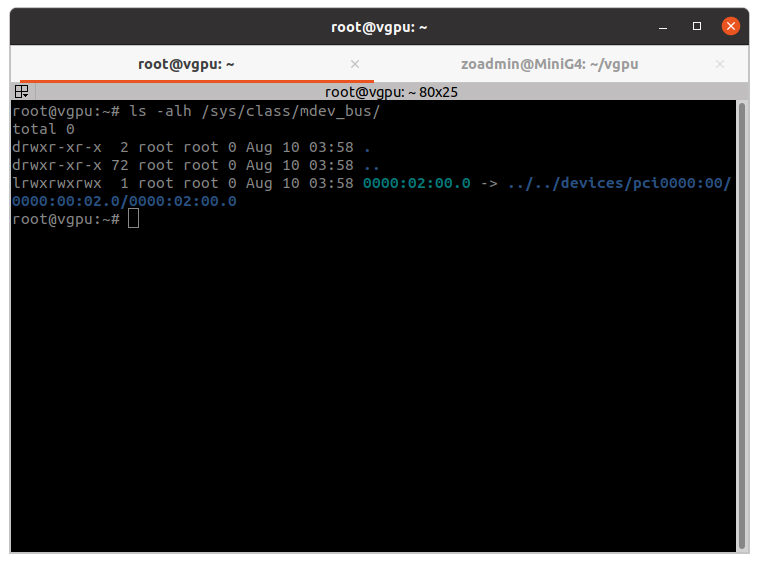
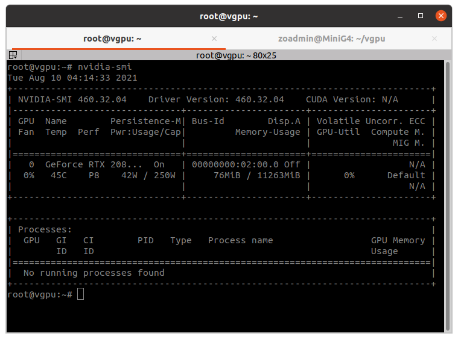

# VGPU-OpenStack
The purpose of this project is to provide instructions on how to enable vgpu_unlock (https://github.com/DualCoder/vgpu_unlock) in an OpenStack environment, using OpenStack-Ansible All-in-One (AIO) to deploy the environment.

## Why VGPU-OpenStack?
That's a good question. There are a lot of fantastic virtualization management systems (Proxmox, Unraid, etc.). All I'm trying to provide is another option. Personally I think OpenStack is great if you want to provide a front end system to remote users that they can manage the virtualized resources themselves, only requiring you to manage the underlying backend. Think of it like providing your own AWS. Combined with a project like vGPU I think it's a fantastic way to setup and provide some virtualized gaming instances with your resources and can even be a great "LAN Party in a Box" system.

#### Requiremendations
* **CPU**: 1+ CPU(s) with as many cores as you can get and support for virtualization.
* **RAM**: I'd recommend AT LEAST 16GB but 64GB sounds a lot better if you are gonna run more than one instance.
* **GPU**: An NVidia Maxwell, Pascal or Turing GPU supported by vgpu_unlock. Limited support is available as well for Volta and Ampere models, but check the vgpu_unlock project as new models are added all the time. For my example, I will be using an RTX 2080Ti. More VRAM allows the use of more and/or larger VMs. More than one graphics card can be used however only a single GRID profile can be used per card. There is also some indication, but I haven't confirmed myself either way, that mixing families (i.e. using a Maxwell and Turing card) is not supported. Additionally, if you have the capability, do not use the NVidia card as your "primary" video card. If you have an Intel or AMD CPU with integrated graphics or a shitty old video card lying around (yeah, I know some of you still have a Radeon HD 5450 lying around, don't lie) use that as your primary as a small amount of video memory is required for your primary to display to function, meaning it can't be allocated for a VM.
* **Disk**: At least 500GB but the more space the better as game libraries add up fast. Also recommend using an SSD.
* **Network**: At least one 1Gbps network port. This project will work on a single, flat network, however having VLAN support will allow you to have separate the front-end access to the VMs and use non-tunneled networks. Having a second network port allows for having a physical separation as well.
* **OS**: For these instructions I am using Ubuntu 20.04 (18.04 is not supported). You CAN use a Red Hat-based distro, such as CentOS 8/RHEL 8, etc., however you will need to adjust the commands in this guide to your distro.

Additionally you will need to get an evaluation license for your GRID guests. Failure to do so will result that the performance inside the VM capped after a certain amount of time, resulting an a framerate that I will describe as "a TI-89 playing Crysis."

Additionally you will need another machine with a hypervisor installed to create a Windows image to use in the OpenStack environment. I used Ubuntu 20.04 Desktop Edition with QEMU/KVM and Virtual Machine Manager for the image creation steps, however you can use other options such as Hyper-V, VirtualBox, ESXi, etc.

#### Helpful terminology

## Instructions
### Part 1 -  This summer, prepare your host for VGPU-OpenStack
First thing you will need to do is pop in to your "root" user. This will just simplify the process. If you want to do it from a "sudo" user feel free to but these are my instructions and I'm not changing them just for you. Once in the root user we will make sure the system is updated and install some required packages. DKMS is required for building the kernel modules for NVidia vgpu and python3-pip is required to install pip3, which is required to install the python library for Frida, which is used by vgpu_unlock. The unzip package is for extracting the NVIDIA drivers.
```
sudo -i
apt update && apt upgrade -y
apt install dkms python3-pip unzip -y
pip3 install frida
```
After you have completed this step, we will need to modify the /etc/hosts file to ensure that the entry for "127.0.1.1" is disabled. Failure to do so will result in the RabbitMQ server failing to configure and start. Using the editor of your choice (I don't judge here, use vi(m), nano, pico, hex editor, export to a Windows machine and edit in Wordpad, whatever), add a comment to the beginning of the line for the entry for address "127.0.1.1" and save the change. Confirm the change matches below:
```
root@vgpu:~# grep 127.0.1.1 /etc/hosts
#127.0.1.1 vgpu.myquantumcs.com vgpu
```
Finally, we will blacklist the nouveau graphics driver kernel module, as this will interfere with the NVidia driver. Then we will update the initramfs image and reboot for the module change to take effect:
```
echo -e "blacklist nouveau\noptions nouveau modeset=0" >> /etc/modprobe.d/nouveau.conf
update-initramfs -u
reboot now
```
After reboot you should be able to confirm that the nouveau driver is no longer loaded:
```
root@vgpu:~# lsmod | grep nouveau
root@vgpu:~#
```

### Part 2 - Installing drivers or How I Learned to Stop Worrying and Love the DKMS
So ... for this part you need teh NVIDIA GRID host drivers for KVM. While the guest drivers are easy enough to come by from just about any cloud provider, the host drivers are a little bit harder to find. I'm not gonna tell you how or where to get them, I'm just gonna assume you have them downloaded and copied to the root users home directory ... moving on ...
Assuming you have them in ZIP format, we need to extract them first and we'll put them in a subdirectory called "GRID". Assuming you have already done so, you can skip this step and run subsequent commands from where your extracted files are located:
```
unzip NVIDIA-GRID-Linux-KVM-460.32.04-460.32.03-461.33.zip -d ./GRID && cd ./GRID
chmod +x NVIDIA-Linux-x86_64-460.32.04-vgpu-kvm.run
```
Now we are ready to install the GRID host driver:
``` 
./NVIDIA-Linux-x86_64-460.32.04-vgpu-kvm.run --dkms
```



### Part 3 - install vGPU_unlock - Dial M for MDEV
Now that the NVIDIA GRID driver is installed we can proceed to install vgpu_unlock. In short, this project intercepts the device ID calls and changes them to match a GRID-capable card that uses the same chip as the GeForce card in your system. There's probably more to it than that but I attribute it to wizardry by people way smarter than me. 

First we will need to download the files for the project. For the sake of this tutorial, I'm putting the files in /opt/vgpu_unlock.
```
git clone https://github.com/DualCoder/vgpu_unlock /opt/vgpu_unlock
```
Now we need to modify the NVIDIA vgpud and vgpu-mgr services to use vgpu_unlock to execute the services. We will do this by modifying the ExecStart line of service unit files:
```
systemctl edit nvidia-vgpud.service --full
```

```
systemctl edit nvidia-vgpu-mgr.service --full
```

Once completed we need to reload the service unit files with the changes.
```
systemctl daemon-reload
```
Now we will need to modify some of the NVidia driver files to use vgpu_unlock:
```
printf '%s\n' '0?#include?a' '#include "/opt/vgpu_unlock/vgpu_unlock_hooks.c"' . x | ex /usr/src/nvidia-460.32.04/nvidia/os-interface.c 
echo "ldflags-y += -T /opt/vgpu_unlock/kern.ld" >> /usr/src/nvidia-460.32.04/nvidia/nvidia.Kbuild 
```
Next, we need to remove the existing NVidia DKMS kernel module:
```
dkms remove -m nvidia -v 460.32.04 --all
```
Below is output from the command:
```
-------- Uninstall Beginning --------
Module:  nvidia
Version: 460.32.04
Kernel:  5.4.0-80-generic (x86_64)
-------------------------------------

Status: Before uninstall, this module version was ACTIVE on this kernel.

nvidia.ko:
 - Uninstallation
   - Deleting from: /lib/modules/5.4.0-80-generic/updates/dkms/
 - Original module
   - No original module was found for this module on this kernel.
   - Use the dkms install command to reinstall any previous module version.


nvidia-vgpu-vfio.ko:
 - Uninstallation
   - Deleting from: /lib/modules/5.4.0-80-generic/updates/dkms/
 - Original module
   - No original module was found for this module on this kernel.
   - Use the dkms install command to reinstall any previous module version.

depmod...

DKMS: uninstall completed.

------------------------------
Deleting module version: 460.32.04
completely from the DKMS tree.
------------------------------
Done.

```
Now we will rebuild the module with with the vgpu_unlock changes:
```
dkms install -m nvidia -v 460.32.04
```
Output from running the command:
```
Creating symlink /var/lib/dkms/nvidia/460.32.04/source ->
                 /usr/src/nvidia-460.32.04

DKMS: add completed.

Kernel preparation unnecessary for this kernel.  Skipping...

Building module:
cleaning build area...
'make' -j32 NV_EXCLUDE_BUILD_MODULES='' KERNEL_UNAME=5.4.0-80-generic IGNORE_CC_MISMATCH='' modules......
cleaning build area...

DKMS: build completed.

nvidia.ko:
Running module version sanity check.
 - Original module
   - No original module exists within this kernel
 - Installation
   - Installing to /lib/modules/5.4.0-80-generic/updates/dkms/

nvidia-vgpu-vfio.ko:
Running module version sanity check.
 - Original module
   - No original module exists within this kernel
 - Installation
   - Installing to /lib/modules/5.4.0-80-generic/updates/dkms/

depmod...

DKMS: install completed.
```

Now we reboot for all the changes to take effect:
```
reboot now
```

Upon reboot, vgpu_unlock should now be working and the NVIDIA services should be functioning properly. To verify the vgpu-mgr is running properly:
```
systemctl status nvidia-vgpu-mgr.service
```
The service should be ```Active: active (running)``` and you should see output similar to ```vgpu bash[1129]: vgpu_unlock loaded.``` on one of the log lines.



T verify the vgpud service, run:
```
systemctl status nvidia-vgpud.service
```

The status should be ```Active: inactive (dead)``` and that's fine. The very bottom line should say ```vgpu systemd[1]: nvidia-vgpud.service: Succeeded.``` This indicates that the service ran as needed properly.




To confirm vgpu_unlock is working you should now have a device on the "Mediated Device" (MDEV) bus. You should be able to see all available usable cards using the following command: 

```ls -alh ls -alh /sys/class/mdev_bus/```

The output should show a folder with a name that matches the PCI Bus ID of your graphics card(s). 



You can confirm this using the command:

```
nvidia-smi
```



Part 4 - Installing OpenStack-Ansible All-In-One - A(IO) New Hope
Now we will begin the process of installing OpenStack on the host system. First we will need to download openstack-ansible. We will also be using the "stable/wallaby" branch as it's the latest stable release.
```
git clone -b stable/wallaby https://opendev.org/openstack/openstack-ansible /opt/openstack-ansible && cd /opt/openstack-ansible
```

Next we need to run the bootstrap script to prepare the host to execute the Ansible plays:
```
scripts/bootstrap-ansible.sh
```
Once completed you should see ```System is bootstrapped and ready for use.``` echoed. Now we will proceed to execute the bootstrap-aio script to create the configurations for OpenStack
```
scripts/bootstrap-aio.sh
```


